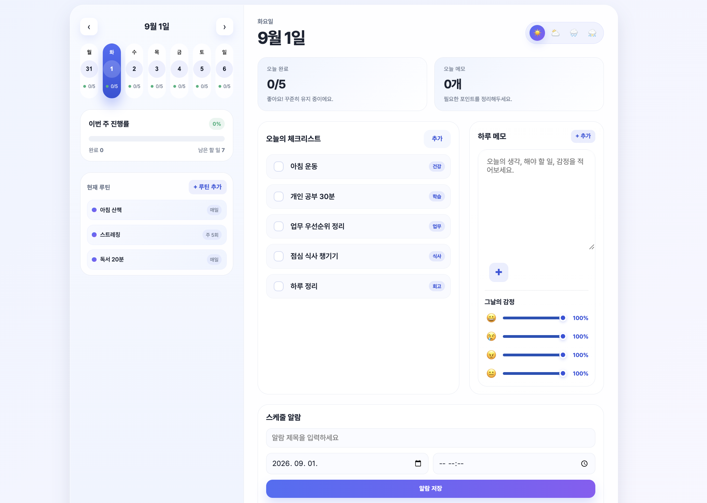

# 바이브코딩 해커톤 - 팀 발표 제출 양식

## 1. 팀명 / 팀원

- 팀명: 05-team
- 팀원 (2명): 이은지, 윤은빈

## 2. 한 줄 소개

> 투두리스트부터 메모, 주간 달력까지 한눈에 볼 수 있는 일상 기록&스케줄 관리 사이트

## 3. 선정 이유 / 해결하려 한 문제

> 일상에서 해야 하는 사소한 행동이나 약속을 자주 잊고, 일기나 메모와 같이 필기가 필요한 상황에서 메모장과 달력 어플을 별도로 사용해야하는 것이 불편해 이를 해결하기 위해 제작하게 되었음. 

## 4. 핵심 기능

- 기능 1: 해야하거나 알림등 일정 to do list 체크박스
- 기능 2: 그날의 상세한 감정(퍼센트 조절)과 일일 메모 기입
- 기능 3: 날짜를 선택하여 루틴 등록 가능

## 5. 사용 기술 스택

- 언어 / 프레임워크: HTML

## 6. AI 활용 포인트

> GitHub Copilot으로 설계하고, 코드 작성에서 도움을 받았음.

## 7. 저장소 링크

>[GitHub repo 링크](https://github.com/kh-thejoeun-hackathon/05_team.git)

## 8. 데모 화면

> 

## 9. 소감 한 마디

> AI 코딩을 활용해보니 원하는 결과를 빠르게 구현할 수 있어 작업의 효율성이 크게 높다는걸 체감했고, 나도 모르는 기능을 알 수 있고 수정이 용이해 좋았다. 